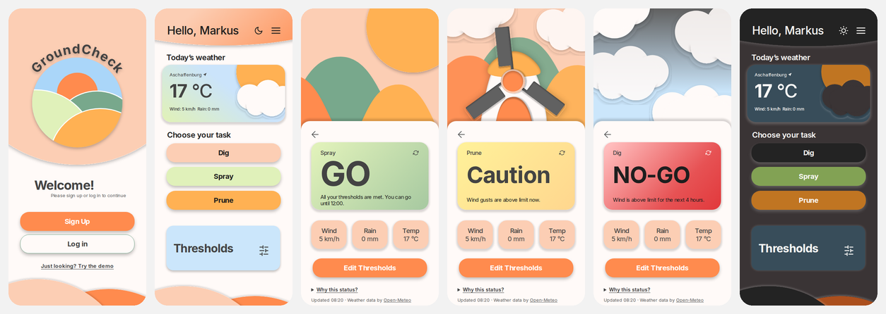
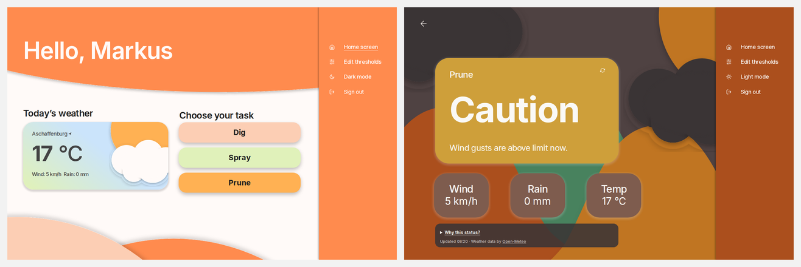
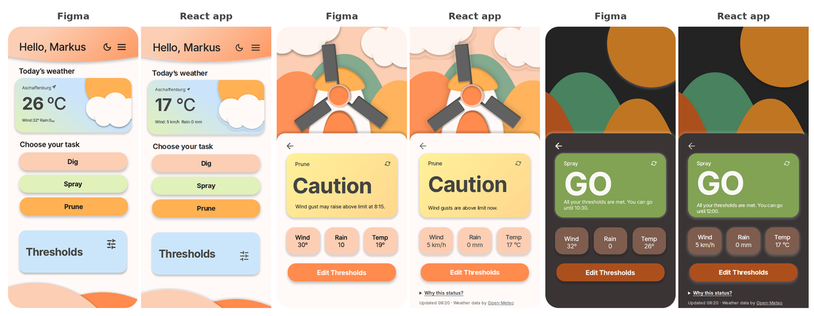

# GroundCheck — web app

GroundCheck turns the next four hours of weather into one clear decision for outdoor work — **GO**, **CAUTION** or **NO-GO** — per task (spraying, digging, pruning), and explains why.

This repository is the **React + TypeScript** implementation of my HCI design project. The research, user tests and Figma prototype live in [groundcheck-hci-project](https://github.com/mounacheikho-cmd/groundcheck-hci-project).

**Live demo:** _link added after deployment_ · press **“Just looking? Try the demo”** — no sign-up needed.





## From Figma to code

The app follows the Figma prototype screen by screen, in mobile (390 px) and desktop (1280 px) layouts, in light and dark mode. Colours come from the Figma variables, and every illustration is an SVG exported from the Figma file.



### Design → code changes

Where the code differs from the prototype, it is on purpose:

| Prototype | App | Why |
| --- | --- | --- |
| Stat tiles show “Wind 32°”, “Rain 0” | “5 km/h”, “0 mm”, “17 °C” | My usability evaluation found the units ambiguous |
| Status card only | Expandable **“Why this status?”** and an **“Updated … · Open-Meteo”** line | Evaluation: “GO” can sound more certain than a forecast is |
| “Wind gust may raise above limit at 8:15” | Times on the hour, e.g. “at 08:00” | Open-Meteo has no 15-minute gust data for Central Europe |
| Log in / Sign up only | Extra **“Try the demo”** link | Visitors can explore without an account (login is mocked) |
| Field labels as static text | Floating labels on real inputs | Same look at rest, but accessible form controls |
| Menu with 7 items | Only working items (Edit thresholds, theme, Sign out) | No dead links; the rest is listed under Roadmap |
| Threshold dropdowns without units | Unit shown under each value | Evaluation: units must be visible |
| White text on the orange (light mode) | Dark text `#1E1E1E` on the same orange | White on `#FF8B4E` is 2.3:1; dark text is 7:1 (WCAG AA). Dark mode already passed |
| Desktop frame 1280 px wide | Scaled evenly between 1024 and 1280 px (down to 80 %), centred above 1280 px | The layout works on every laptop width, not just the frame size |
| Greeting shows the full name | First name only, up to 12 characters (longer ends in “…”) | Long names no longer wrap or run under the icons |

## Features

- GO / CAUTION / NO-GO for Spray, Dig and Prune, from the live [Open-Meteo](https://open-meteo.com/) forecast
- Six editable thresholds per task (min/max wind, rain, temperature), validated and saved in the browser
- “Why this status?” with every limit checked, value and unit
- Mobile layout with menu drawer, desktop layout with sidebar
- Light and dark mode (follows the system, remembers your choice, no flash on load)
- Mock authentication behind an `AuthService` interface, ready for a real backend

## Decision rules

The app checks the current hour and the next three hours of hourly forecast (`temperature_2m`, `precipitation`, `wind_speed_10m`, `wind_gusts_10m`).

| State | Rule |
| --- | --- |
| **NO-GO** | The current hour breaks a wind, rain or temperature limit |
| **CAUTION** | A later hour breaks a limit, gusts exceed the max wind, or a value is within its margin (wind 10 %, temperature 2 °C, rain none) |
| **GO** | All four hours are within limits and outside the margins |

If the forecast can’t be loaded, the app shows an error and **never** an old or guessed status.

Default thresholds (editable in the app; values marked * are starting assumptions):

| Task | Wind (km/h) | Rain (mm/h) | Temperature (°C) |
| --- | --- | --- | --- |
| Spray | 5 – 15 | max 0 | 5* – 27 |
| Dig | max 40* | max 4* | 0 – 30 |
| Prune | max 40 | max 0 | 0* – 30 |

Sources: [UMN Extension](https://extension.umn.edu/herbicides/too-windy-to-spray), [Missouri IPM](https://ipm.missouri.edu/meg/index.cfm?ID=468), [OSHA heat hazards](https://www.osha.gov/heat-exposure/hazards), [Promax Access](https://promaxaccess.com/safer-tree-work-wind-factors/), [Mid-Columbia Forestry](https://www.trees4you.org/from-plants-to-planting/2016/12/30/avoid-spreading-disease-by-pruning).

> GroundCheck is a portfolio project, not a safety system. Product labels and local safety rules always come first.

## Tech stack

| Concern | Choice |
| --- | --- |
| UI | React 19, TypeScript (strict), CSS Modules with design tokens |
| Build | Vite |
| Routing | React Router with protected routes |
| Server state | TanStack Query (caching, retries, refetch) |
| Validation | Zod — API responses, saved settings and forms |
| Tests | Vitest + Testing Library (unit, component, flow), Playwright (end-to-end, mobile + desktop) |
| Quality | ESLint, Prettier, GitHub Actions |
| Fonts | Inter and Istok Web, self-hosted via Fontsource (no Google Fonts requests) |
| Hosting | Vercel |

## Project structure

```
src/
  domain/      decision engine: types, default thresholds, evaluate() + tests
  api/         Open-Meteo client (Zod-validated), TanStack Query hook, recorded fixture
  context/     auth (mock service, session until the tab closes), theme, thresholds — saved in the browser
  components/  Button, TextField, WeatherCard, DecisionCard, StatCards, ThresholdField, Menu, Decor …
  screens/     Welcome, Login, Signup, Home, Result, Thresholds, NotFound
  styles/      tokens.css (light + dark), global.css
  assets/      illustrations exported from Figma (light + dark)
e2e/           Playwright tests
```

A short code walkthrough is in [docs/ARCHITECTURE.md](docs/ARCHITECTURE.md).

The decision logic in `src/domain/evaluate.ts` is a pure function with no React or network code, so it is fully unit-tested. Illustrations are placed by their Figma coordinates through a small `Decor` component; all content uses normal, responsive CSS layout.

## Run it locally

```bash
npm install
npm run dev          # http://localhost:5173
```

| Command | What it does |
| --- | --- |
| `npm test` | Unit, component and flow tests (Vitest) |
| `npm run e2e` | End-to-end tests in Chromium (run `npx playwright install chromium` once) |
| `npm run lint` | ESLint |
| `npm run typecheck` | TypeScript |
| `npm run build` | Production build |

## Roadmap

- Real accounts with a backend (Supabase), replacing the mock `AuthService`
- Location search and “Use my location”
- Change name, Contact and Help screens from the prototype
- 15-minute precision for wind, rain and temperature

## Credits

- Design, research and requirements: Mouna Cheikho
- Weather data by [Open-Meteo.com](https://open-meteo.com/) (CC BY 4.0)
- Icons based on [Feather](https://feathericons.com/) (MIT) · Fonts: Inter and Istok Web (SIL Open Font License)
